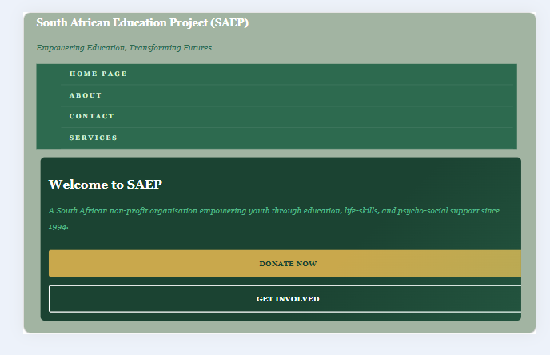
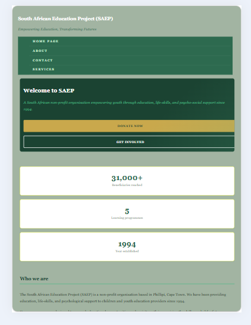

# South African Education Project
Empowering Education, Transforming Futures
the SAEP is a non-profit organization that offers children and the youth the education and life skills needed for future education or employment.
# Website pages
* [Homepage](index.html)
* [About](pages/about.html)
* [Contact](pages/contact.html)
* [Services](pages/services.html)
# Features
* Built with modern HTML senamatic elements.
*Structured Layout matching an original wireframe blueprint.
*Organized file architecture using subfolders.
*External CSS stylesheet for consistent styling across all pages.
*Responsive design that works on desktop, tablet, and mobile devices.
*interactive navigation with hover and focus effects.
# Software used
* HTML
* CSS

# Part 2- CSS Styling and Responsive Design
# What was added in part 2.
* Created an external stylesheet (style.css) linked to all HTML pages.
* Applied a consistent color scheme using CSS custom properties (green and gold)
* Set base styles including font family, font size, line height, and spacing.
* Applied typography styles using font-family, font-size, font-weight, line-height, and letter-spacing.
* Created layout structure using CSS F1 exbox for navigation and header.
* Created layout structure using CSS Grid for services, mission/vision, and contact sections.
* Applied visual styles including background-color, border, box-shadow, and border-radius.
* Added interactive pseudo-classes including :hover, :focus, and :active on buttons and links.
* Implemented responsive design using three media query breakpoints.
* Used relative units including rem, em, and % throughout the stylesheet.
* Added responsive images using srcset and the picture element.

# Changelog
# Part 1 feedback changes
* Fixed navigation links to use correct file paths
* Wrapped in navigation links in ul and li tags for correct HTML structure.
* Moved CTA buttons outside of the nav element into the main content area.
* Corrected semantic HTML structure across all pages.

# Part 2 Changes
* Added style.css external stylesheet and linked it to all four HTML pages.
Added CSS reset to ensure consistent styling across all browswers.
* Added CSS custom properties for color scheme, spacing scale, and typography scale.
* Applied flexbox layout to header, navigation, footer, and button groups.
* Applied CSS Grid layout to services page (2 columns), About page mission/vision (2 columns), stats strip (3 columns), and contact page (2 columns).
* Added hover effects on navigation links, service cards, stat cards, and buttons.
* Added three responsive breakpoints at 1024px (tablet), 768px (small tablet), and 480px (mobile)
* Added responsive images with srcset and size attributes.
* Updated README with Part 2 documentation and changelog.

# Screenshots
# Desktop view (1200px)

# Tablet view (768px)

# Mobile view (375px)

# References
* South African Education Project(SAEP). (2024). About SAEP. https://www.saep.org/about 
* Mozilla Developer Network. (2024). CSS reference. https://developer.mozilla.org/en-US/docs/Web/CSS 
* Mozilla Developer Network. (2024). Responsive images. https://developer.mozilla.org/en-US/docs/Web/HTML/Guides/Responsive_images 
* W3Schools. (2024). CSS media queries. https://www.w3schools.com/css/default.asp 